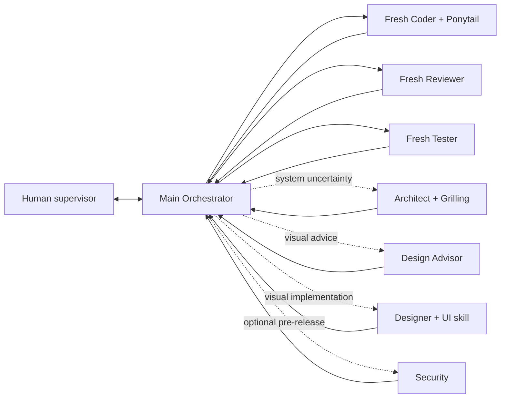

# Pavan's Workflow

A reusable **multi-model, multi-agent development workflow** for
[Oh My Pi (`omp`)](https://github.com/can1357/oh-my-pi), with scoped
[Graphify](https://github.com/Graphify-Labs/graphify) navigation, Coder-only
[Ponytail](https://github.com/DietrichGebert/ponytail), and an optional
Human-requested Product Designer path.

> **Workflow v3.1.3 is live.** Update an installed project from its root:
>
> ```bash
> ( tmp_dir="$(mktemp -d)" && git clone -q --depth 1 https://github.com/Pavan-Gopa/Pavans-Workflow.git "$tmp_dir/pw" && bash "$tmp_dir/pw/AI_Workflow_Kit/script/workflow_update.sh" apply; rc=$?; rm -rf "${tmp_dir:-}"; exit "$rc" )
> ```
>
> Inside OMP, run `/work-update` or `/workflow-update`, then restart OMP.
>
> **v3.1.0 config hotfix:** if OMP moved `.omp/config.yml` to a
> `.omp/config.yml.broken-*` file, run the same updater command. v3.1.1+
> restores the newest project-specific role mapping automatically and writes
> YAML-safe quoted `@workflow_*` aliases before the doctor runs.

## v3.1 highlights

- **Actually scrollable Alt+W:** v3.1.3 mounts the dashboard as a true fullscreen
  OMP overlay with mouse tracking enabled. The complete plan/checklist/RUN TODO
  board is reachable with the mouse wheel, PageUp/PageDown, Shift+Up/Down, and
  `g`/`G`; closing Alt+W restores the normal OMP screen.
- **Full logical board:** v3.1.2 expands long plan/checklist/RUN TODO content
  before viewport rendering instead of replacing it with `N more detail lines`.
- **Live plan cursor restored:** Alt+W follows actual current work even when
  canonical `current_step` is temporarily stale. Arrow navigation pauses follow;
  `c` returns to the live step.
- **Separate selected and live states:** `*` marks what the Human is inspecting;
  `>` marks what the workflow is actually executing.
- **Optional Design Advisor:** lower-cost read-only UI/UX brief for ordinary Coder.
- **Optional Designer:** a strong visual model such as Kimi may directly redesign
  one bounded presentation-layer surface.
- **Visual safety:** Designer preserves behavior, APIs, data flow, localization,
  accessibility, security, and unrelated scope; direct edits still pass Main,
  Reviewer, Tester, and final Human acceptance.
- **Safe project updates:** missing design aliases are added without overwriting
  existing model selections or live project memory. v3.1.1 also repairs the
  malformed v3.1.0 role-alias YAML regression automatically.
- **Non-blocking updates:** existing Graphify output is preserved and refresh is
  deferred by default; an explicit refresh is bounded by a portable timeout.
- **v3 foundations remain:** Coder-only Ponytail, conditional Graphify, manual OMP
  Stats, stable IDs, dual Todo, passive metrics, fresh workers, and manual failover.

## Architecture



All routing goes through Main. Workers never route, invoke another worker,
commit, push, or write canonical workflow state.

The default loop is unchanged:

```text
Main -> Coder -> Main verification
     -> Reviewer -> Main verification
     -> Tester -> Main verification
     -> next step
```

Designer is not automatic. It is used only after explicit Human feedback or a
direct request.

## Multi-model role pairs

Configure through **Alt+M → Roles**:

| Role | Primary | Human-authorized backup |
|---|---|---|
| Orchestrator | `@workflow_orchestrator` | `@workflow_orchestrator_backup` |
| Coder | `@workflow_coder` | `@workflow_coder_backup` |
| Reviewer | `@workflow_reviewer` | `@workflow_reviewer_backup` |
| Tester | `@workflow_tester` | `@workflow_tester_backup` |
| Architect | `@workflow_architect` | `@workflow_architect_backup` |
| Security | `@workflow_security` | `@workflow_security_backup` |
| Design Advisor | `@workflow_design_advisor` | `@workflow_design_advisor_backup` |
| Designer | `@workflow_designer` | `@workflow_designer_backup` |

The two design roles are optional. By default they alias existing Reviewer and
Architect models so upgrades remain immediately valid. Assign Kimi or another
strong visual model to `workflow_designer` when desired. Missing design roles do
not block ordinary development.

Persistent model/provider failure pauses. Main never switches to a backup
automatically; the Human must explicitly authorize the recorded role.

## Optional Designer path

### Lower-cost advice

```text
/workflow designer advise settings panel
```

or:

```text
Consult the designer, but let ordinary Coder implement the result.
```

`workflow-design-advisor` returns a concrete brief: problems tied to evidence,
precise changes by file/component, responsive/accessibility requirements,
non-goals, implementation order, and observable visual acceptance.

### Direct redesign

```text
/workflow designer redesign settings panel
```

or:

```text
The feature works, but the UI looks bad. Let Designer rewrite this component.
```

Main confirms target files and preserved behavior, then dispatches
`workflow-designer`. The role may edit assigned components, styles, approved
assets, and UI tests only. It must render/capture/inspect when project tooling
supports it. The result goes through normal engineering review and QA, then the
Human makes final visual acceptance.

## Ponytail without role leakage

Only primary and backup Coder autoload `ponytail`. Confirmed scope, target files,
stable IDs, gates, validation, security, accessibility, compatibility, and data
integrity outrank simplification. Designer and Advisor load `ui-designer`, not
Ponytail.

Manual one-shot skills remain available:

```text
/skill:ponytail-review
/skill:ponytail-audit
/skill:ponytail-debt
```

## Conditional Graphify

```text
non-trivial discovery -> Graphify -> focused real source -> verify
known exact local symbol -> focused LSP/grep/read -> verify
```

Profiles:

```bash
bash AI_Workflow_Kit/script/graphify_rebuild.sh fast
bash AI_Workflow_Kit/script/graphify_rebuild.sh deep
bash AI_Workflow_Kit/script/graphify_rebuild.sh semantic
bash AI_Workflow_Kit/script/graphify_rebuild.sh force
```

Graphify is advisory. Workflow updates preserve the existing graph and defer
refresh by default, so updating cannot appear frozen on a large repository.
Refresh afterward:

```bash
bash AI_Workflow_Kit/script/graphify_rebuild.sh fast
```

Or request a bounded refresh as part of the update:

```bash
bash AI_Workflow_Kit/script/workflow_update.sh apply --refresh-graphify
```

## Alt+W live dashboard

Alt+W opens a **fullscreen read-only inspector** showing plan,
selected/current step, Main-verified `STEP CHECKLIST`, native `RUN TODO`, active
worker/model/tool, gates, blockers, passive metrics, session tokens, and the
copyable Stats URL. The normal OMP transcript is restored when the dashboard
closes.

Markers:

```text
* = selected for inspection
> = live workflow step
✓ = completed
● = current/running
○ = planned
```

The dashboard has one vertical viewport over the **complete logical board**.
When all content fits, it shows no scrollbar. When plan/checklist/Todo content
is taller than the terminal, no data is replaced with `N more detail lines`;
scroll to it instead. Because Alt+W is mounted as a fullscreen mouse-tracked OMP
overlay, terminal wheel events are delivered to its ScrollView.

```text
mouse wheel        scroll 3 lines
PageUp/PageDown    scroll one page
Shift+Up/Down      fast vertical scroll
g / G              top / bottom
Up/Down            inspect previous/next workflow step (existing behavior)
Home/End            first/last workflow step (existing behavior)
c                   return to live step and resume live-follow
```

Manual vertical scrolling pauses live-follow so runtime updates do not yank the
viewport away while you inspect older content. Press `c` to resume following the
current step.

If runtime evidence proves a different live step than `STATE.yaml`, the dashboard
uses the runtime step for display and shows a drift warning. It never writes
state itself.

## OMP Stats is manual

The footer always exposes:

```text
OMP Stats · manual · http://127.0.0.1:3847
```

Nothing starts at OMP launch, and there is no persistent widget. Press `o` in
Alt+W or run `/workflow-stats` to explicitly start, sync, and open it.

## Install

### New repository

```bash
git clone https://github.com/Pavan-Gopa/Pavans-Workflow.git my-project
cd my-project
bash install.sh .
```

### Existing repository without the workflow

```bash
tmp_dir="$(mktemp -d)"
git clone --depth 1 https://github.com/Pavan-Gopa/Pavans-Workflow.git "$tmp_dir/pw"
bash "$tmp_dir/pw/install.sh" /absolute/path/to/your/project
rm -rf "$tmp_dir"
```

Use the updater—not the installer—for projects already running v2 or v3.
Full notes: [INSTALL.md](INSTALL.md).

## Start

```bash
bash AI_Workflow_Kit/script/omp_workflow.sh
```

## Update an existing workflow project

Close that project's OMP process first, then run from the project root:

```bash
( tmp_dir="$(mktemp -d)" && git clone -q --depth 1 https://github.com/Pavan-Gopa/Pavans-Workflow.git "$tmp_dir/pw" && bash "$tmp_dir/pw/AI_Workflow_Kit/script/workflow_update.sh" apply; rc=$?; rm -rf "${tmp_dir:-}"; exit "$rc" )
```

If v3.1.0 already caused OMP to rename `.omp/config.yml` to
`.omp/config.yml.broken-*`, do **not** delete that backup. The v3.1.1+ updater
uses it to recover your existing role selections, quotes all bare `@workflow_*`
role references safely, adds only missing design aliases, then validates the
result before continuing.

To refresh Graphify during the same update, append `--refresh-graphify`; the
refresh is terminated after the configured timeout and cannot block the updater
indefinitely.

The updater preserves:

- `.omp/config.yml` selections, recovering them from the newest project backup
  when necessary and adding only missing optional design aliases;
- `STATE.yaml`, `STEPS.md`, `PROJECT_CONTEXT.md`, decisions, feedback, and reports;
- product code and tests;
- custom `.graphifyignore` rules, while appending the new control-plane exclusion.

It backs up replaced framework paths under Git's private common directory, runs
migration and doctor, preserves the existing Graphify index by default, and
tells you to restart OMP.

## Useful controls

| Action | Control |
|---|---|
| Update framework | `/work-update` or `/workflow-update` |
| Dry-run update | `/work-update check` |
| Reconcile and continue | `/workflow status` |
| Explain routing | `/workflow why` |
| Designer advice | `/workflow designer advise <surface>` |
| Designer edits | `/workflow designer redesign <surface>` |
| Live dashboard | `Alt+W` |
| Dashboard scroll | mouse wheel / PgUp/PgDn / Shift+Up/Down / `g`/`G` |
| Agent Hub | `Alt+A` |
| Model roles | `Alt+M` |
| Manual OMP Stats | `o` in Alt+W or `/workflow-stats` |
| Diagnostics | `bash AI_Workflow_Kit/script/workflow_doctor.sh` |

## Repository map

```text
.omp/                         agents, commands, extensions, shared runtime
ui-designer/                  progressive UI/UX skill for optional design roles
ponytail*/                    Coder simplification and one-shot audit skills
grilling/                     architecture discovery skill
AI_Workflow_Kit/docs/         durable workflow state and role contracts
AI_Workflow_Kit/script/       launcher, update, doctor, metrics, Graphify
AI_Workflow_Kit/vendor/       dependency/version metadata
VERSION                       current workflow version
CHANGELOG.md                  release notes
```

MIT. See [LICENSE](LICENSE).