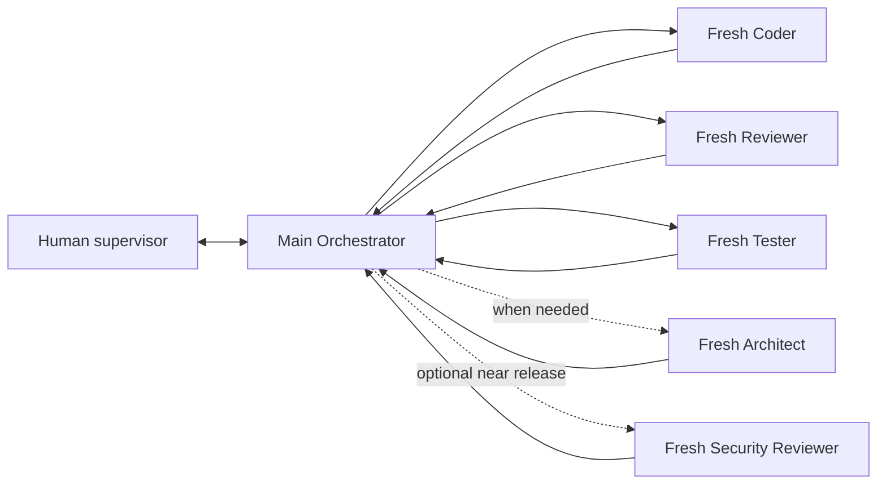

# Pavan's Workflow

A reusable **multi-model, multi-agent development workflow** for
[Oh My Pi (`omp`)](https://github.com/can1357/oh-my-pi), with
[Graphify](https://github.com/Graphify-Labs/graphify) as the shared code
intelligence layer.

This is deliberately more than a multi-agent prompt pack. Every role has an
independent **primary** and **backup** OMP model alias. You can combine providers
so a quota wall or provider outage does not stop a long workflow:

- one primary/backup pair for orchestration;
- another pair for architecture and deep discovery;
- a fast pair for implementation;
- an independent pair for code review;
- a careful pair for QA;
- a maximum-quality pair for the optional final security audit.

You choose both models. The workflow owns role boundaries, fresh context,
routing, file-backed state, automatic model failover, Graphify navigation, a
live workflow dashboard, and human supervision.

## What it automates



All routing goes through Main. A worker never hands work to another worker and
never decides the next role.

Default step loop:

```text
Main → Coder → Main verification
     → Reviewer → Main verification
     → Tester → Main verification
     → next step
```

If a gate fails, Main records verified evidence and starts a **new** Coder
session. After three materially identical failures, automatic retries stop and
the workflow surfaces a blocker or routes once to Architect.

## Core properties

### Multi-model by design

Every role resolves through `.omp/config.yml`:

| Role | OMP agent | Primary alias | Backup alias |
|------|-----------|---------------|--------------|
| Orchestrator | Main session | `@workflow_orchestrator` | `@workflow_orchestrator_backup` |
| Architect | `workflow-architect` | `@workflow_architect` | `@workflow_architect_backup` |
| Coder | `workflow-coder` | `@workflow_coder` | `@workflow_coder_backup` |
| Code Reviewer | `workflow-reviewer` | `@workflow_reviewer` | `@workflow_reviewer_backup` |
| Tester | `workflow-tester` | `@workflow_tester` | `@workflow_tester_backup` |
| Security Reviewer | `workflow-security` | `@workflow_security` | `@workflow_security_backup` |

Change either alias without rewriting a role prompt.

### Automatic model failover

OMP's native retry fallback handles repeated `429` responses, quota walls, and
provider outages. Each worker starts on its primary model and continues the
same task on its backup when the primary becomes unavailable. Main receives a
runtime fallback chain generated by `omp_workflow.sh`.

`fallbackRevertPolicy: never` keeps a session on its backup after failover,
avoiding primary/backup thrashing. A fresh worker tries its primary again.
Provider diversity is strongly recommended; two aliases on the same provider
do not protect against a provider-wide outage.

### Fresh context

Each specialized worker is an independent OMP task-agent session. It receives
only:

1. its stable role contract;
2. the current assignment;
3. source-of-truth file paths;
4. allowed paths and acceptance criteria;
5. access to the live repository and Graphify.

It does not inherit Main's conversation history or another worker's transcript.

### Files are memory

Conversation history is not authoritative. Durable workflow state lives in:

- `AI_Workflow_Kit/docs/AI/STATE.yaml`;
- `AI_Workflow_Kit/docs/STEPS.md`;
- `AI_Workflow_Kit/docs/DECISIONS.md`;
- `AI_Workflow_Kit/docs/AI/FEEDBACK.md`;
- QA, bug, and security report files;
- the actual repository, diff, and test output.

Only Main writes workflow state. Worker completion alone never advances a gate;
Main verifies the real source and evidence first.

### Live workflow dashboard

Press **Alt+W** (or run `/workflow-dashboard`) inside OMP to open the
project-level live panel. It reads the canonical `STATE.yaml` and current
`STEPS.md` card, listens to OMP's task-agent progress events, and shows:

- completed/remaining step counts and the current step checklist;
- the active role, agent, resolved model, fallback status, intent, and tool;
- implementation, review, QA, security, and blocker gates;
- every role's primary/backup model pair;
- redacted provider-reported quota and reset windows from `omp usage`.

The panel is observational: it never writes workflow state. Use
`Up`/`Down`/`PgUp`/`PgDn` to scroll, `r` to refresh provider usage, and
`Alt+W`, `Esc`, or `q` to close it. Agent Hub remains the detailed transcript
and intervention surface.

### Graphify-first navigation

All roles follow:

```text
GRAPHIFY → FIND
SOURCE CODE → VERIFY
```

Graphify localizes relevant symbols, dependencies, callers/callees, tests, data
flow, and blast radius. Agents then read the smallest relevant real source slice
before editing or concluding.

The included rebuild script attempts semantic extraction and falls back to
local AST code-only indexing when no supported semantic backend is configured.

### Human supervision

OMP Agent Hub keeps the process observable:

- press `Alt+A` to see active agents, role, resolved model, usage, and activity;
- open a worker transcript;
- steer or stop a worker;
- give Main a new instruction at any time;
- restart a role with fresh context.

The workflow automates mechanical routing; it does not remove human control.

### Grilling

The included `grilling` skill turns ambiguous work into explicit decisions and
an execution-ready plan:

- quick mode runs in Main;
- deep mode runs in the read-only Architect agent;
- only Main persists an approved Architecture Package, ADR, glossary change, or
  step plan.

## Requirements

- OMP — required host.
- Git — for cloning/checkpoints.
- Graphify — installed automatically when possible by `install.sh`.
- Python 3.10+ plus `uv` or `pipx` if Graphify is not installed.
- Credentials for whichever model providers you choose in OMP.

No model provider or API key is hard-coded into this repository.

## Install OMP

Official macOS/Linux installer:

```bash
curl -fsSL https://omp.sh/install | sh
```

Homebrew:

```bash
brew install can1357/tap/omp
```

Bun:

```bash
bun install -g @oh-my-pi/pi-coding-agent
```

Windows PowerShell:

```powershell
irm https://omp.sh/install.ps1 | iex
```

Source and current installation options:
[can1357/oh-my-pi](https://github.com/can1357/oh-my-pi).

## Fastest installation: ask OMP

Open OMP inside the target project and paste:

```text
Install Pavan's Workflow from
https://github.com/Pavan-Gopa/Pavans-Workflow into this repository.

Read README.md and INSTALL.md from that repository first. Preserve this
repository's existing files and Git history. Clone the workflow to a temporary
directory, inspect conflicts, and use its install.sh only when it will not
overwrite existing project configuration. If workflow paths already exist,
merge conservatively instead of replacing them. Ensure Graphify is installed
from the official `graphifyy` package, build the initial graph, and verify that
OMP discovers the project agents, `/workflow` command, and `grilling` skill.
Then show me the available models from `omp models` and ask me to choose the
model mapping for each workflow role before starting product work.
```

The agent downloads, installs, checks conflicts, verifies discovery, and leaves
model selection to you.

## Manual installation

New project from the template:

```bash
git clone https://github.com/Pavan-Gopa/Pavans-Workflow.git my-project
cd my-project
./install.sh .
```

Existing project:

```bash
tmp_dir="$(mktemp -d)"
git clone --depth 1 https://github.com/Pavan-Gopa/Pavans-Workflow.git "$tmp_dir/pavans-workflow"
"$tmp_dir/pavans-workflow/install.sh" /absolute/path/to/your/project
```

The installer refuses to overwrite existing workflow paths.

Full platform instructions: [INSTALL.md](INSTALL.md).

## First-run onboarding and model pairs

Launch the workflow:

```bash
./AI_Workflow_Kit/script/omp_workflow.sh
```

On first launch, Main shows an onboarding screen before dispatching any worker.
It explains the pipeline, displays all primary/backup assignments, and offers
configuration, current defaults, failover details, or pause.

Press **Alt+M** (or run `/models`) and open the native selector's **Roles**
view. Configure both entries for every role:

```text
workflow_<role>          primary
workflow_<role>_backup   backup
```

Typing filters models available through your configured providers. The template
sets `modelRoleStorage: project`, so OMP persists UI assignments to this
project's `.omp/config.yml`; manual YAML editing is unnecessary.

After choosing the pairs, return to Main and run:

```text
/workflow ready
```

Main validates all twelve assignments before starting the cycle. Worker changes
apply on their next spawn. Relaunch `omp_workflow.sh` after changing either
Orchestrator model so Main's fallback chain is rebuilt.

Inspect pairs from a terminal:

```bash
AI_Workflow_Kit/script/workflow_models.sh status
omp models find <name>
```

Prefer different providers for each primary/backup pair and a different model
family for Reviewer than Coder.

## Start the workflow

```bash
./AI_Workflow_Kit/script/omp_workflow.sh
```

Or launch OMP normally, then start onboarding:

```bash
omp --model @workflow_orchestrator
/workflow onboard
```

Useful controls:

| Action | Control |
|--------|---------|
| Re-read state and continue | `/workflow status` |
| Redirect Main | `/workflow <new instruction>` |
| Open live workflow/model/quota panel | `Alt+W` or `/workflow-dashboard` |
| Inspect/steer/kill workers | `Alt+A` |
| Pause Main and workers safely | `/pause` |
| Change role model assignments | `Alt+M` or `/models` |
| Reopen onboarding/model setup | `/workflow setup` |
| Query models from the terminal | `omp models` |

## Repository map

```text
.omp/
  AGENTS.md                   shared workflow contract
  config.yml                  role aliases and task lifecycle
  agents/                     five specialized worker definitions
  commands/workflow.md        orchestration entry point
  extensions/workflow-dashboard.ts live workflow/model/quota panel
grilling/                     discovery and decision skill
AI_Workflow_Kit/
  docs/                       state, plans, role contracts, reports
  script/omp_workflow.sh      launcher
  script/workflow_models.sh    model-pair validation and Main fallback overlay
  script/graphify_rebuild.sh  Graphify refresh
  script/workflow_doctor.sh   installation/configuration check
  script/checkpoint.sh        scoped Git checkpoints
PIPELINE.md                   concise process overview
INSTALL.md                    full installation guide
install.sh                    safe template installer
```

## Extend it

Fork the repository and add roles, change output schemas, replace model aliases,
or adapt the state machine. Keep the central invariants if you want the same
operational behavior:

- one controlling Main;
- fresh workers;
- no worker-to-worker routing;
- Main-only state writes;
- file-backed source of truth;
- Graphify for navigation, source for verification;
- explicit human supervision.

## License

MIT. See [LICENSE](LICENSE).
