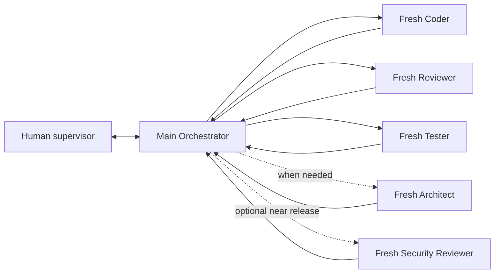

# Pavan's Workflow

A reusable **multi-model, multi-agent development workflow** for
[Oh My Pi (`omp`)](https://github.com/can1357/oh-my-pi), with
[Graphify](https://github.com/Graphify-Labs/graphify) as the shared code
intelligence layer.
> ⚡ **Workflow v2 is live!** Update any project in one command:  
> * **In terminal:** `curl -fsSL https://raw.githubusercontent.com/Pavan-Gopa/Pavans-Workflow/main/AI_Workflow_Kit/script/workflow_update.sh | bash`  
> * **Inside OMP chat:** `/work-update` (or `/workflow-update`)  
> **Key Highlights:** **Progressive Onboarding** (start immediately on 1 model), **Dual Todo & Stable IDs** (`STEP CHECKLIST` + `RUN TODO`), **Embedded OMP Stats** (`http://127.0.0.1:3847`, press `o` in `Alt+W`), **Live Worker Details & Stall Warnings**, **Why Next** (`/workflow why`), and **Pipeline Profiles** (`quick`/`standard`/`critical`).

This is deliberately more than a multi-agent prompt pack. Every role has an
independent **primary** and **backup** OMP model alias. Worker backups are
separate, Human-authorized execution variants, so a quota wall can be recovered
without silently switching models or spending a backup allowance:

- one primary/backup pair for orchestration;
- another pair for architecture and deep discovery;
- a fast pair for implementation;
- an independent pair for code review;
- a careful pair for QA;
- a maximum-quality pair for the optional final security audit.

You choose both models. The workflow owns role boundaries, fresh context,
routing, file-backed state, Human-authorized model failover, Graphify
navigation, a live workflow dashboard, and human supervision.

## What it automates



All routing goes through Main. A worker never hands work to another worker and
never decides the next role.

Default step loop:

```text
Main → Coder → Main verification
     → Reviewer → Main verification
     → Tester → Main verification
     → next step
```

If a gate fails, Main records verified evidence and starts a **new** Coder
session with compact retry memory: approach, observed result, evidence, and why
it was rejected. Only materially identical failures of the same approach count
toward the three-attempt stop; a new approach, new evidence, or different
failure is progress.

## Core properties

### Multi-model by design

Every role resolves through `.omp/config.yml`:

| Role | OMP agent | Primary alias | Backup alias |
|------|-----------|---------------|--------------|
| Orchestrator | Main session | `@workflow_orchestrator` | `@workflow_orchestrator_backup` |
| Architect | `workflow-architect` | `@workflow_architect` | `@workflow_architect_backup` |
| Coder | `workflow-coder` | `@workflow_coder` | `@workflow_coder_backup` |
| Code Reviewer | `workflow-reviewer` | `@workflow_reviewer` | `@workflow_reviewer_backup` |
| Tester | `workflow-tester` | `@workflow_tester` | `@workflow_tester_backup` |
| Security Reviewer | `workflow-security` | `@workflow_security` | `@workflow_security_backup` |

Worker definitions consume only their primary aliases. After a recorded model
failure and explicit Human instruction, Main starts the matching
`workflow-<role>-backup` agent on the backup alias. Main's own backup is selected
manually in the live model selector. Change either alias without rewriting a
role prompt.

### Human-authorized model failover

Automatic cross-model fallback is disabled. OMP may retry transient requests on
the same model, but a persistent `429`, quota wall, or provider outage returns
control to Main. Main records the failed role/model/error in `STATE.yaml`, marks
the workflow blocked, and stops.

Only an explicit Human instruction such as “continue Tester with its backup”
allows Main to start a fresh `workflow-tester-backup` run with the original
self-contained assignment. If the backup fails, the workflow pauses again.
Invalid prompts, test failures, tool failures, and Human-aborted runs are not
model-failover events.

If Main's own model is unavailable, switch the live session to
`@workflow_orchestrator_backup` through `/model` or **Alt+M**, then run
`/workflow status`. Provider diversity is still recommended: two aliases on the
same provider do not protect against a provider-wide outage.

### Fresh context

Each specialized worker is an independent OMP task-agent session. It receives
only:

1. its stable role contract;
2. the current assignment;
3. source-of-truth file paths;
4. allowed paths, Objective Gates, and Reviewer-owned Judgment Gates;
5. access to the live repository and Graphify.

It does not inherit Main's conversation history or another worker's transcript.

On retry, it may also receive a compact verified summary from `FEEDBACK.md`.
It never receives the prior Coder transcript, chain-of-thought, or Main history.

### Files are memory

Conversation history is not authoritative. Durable workflow state lives in:

- `AI_Workflow_Kit/docs/AI/STATE.yaml`;
- `AI_Workflow_Kit/docs/STEPS.md`;
- `AI_Workflow_Kit/docs/DECISIONS.md`;
- `AI_Workflow_Kit/docs/AI/FEEDBACK.md`;
- QA, bug, and security report files;
- the actual repository, diff, and test output.

Only Main writes workflow state. Worker completion alone never advances a gate;
Main verifies the real source and evidence first.

### Live workflow dashboard

Press **Alt+W** (or run `/workflow-dashboard`) inside OMP to open the
read-only live task board. On a wide terminal it renders `PLAN | CURRENT STEP |
STATISTICS`; medium and narrow terminals reflow the same information without
changing the workflow. It reads canonical `STATE.yaml` and `STEPS.md`, listens
to OMP task-agent progress, and shows:

- the real plan order, completed/remaining counts, selected step, and the
  Main-verified `STEP CHECKLIST` (carrying stable IDs `<step>.D<n>`);
- the native OMP session `RUN TODO` alongside the step checklist, with linkage
  between runtime subtasks and step items (press `t` to cycle `Both` / `Step` / `Run` views);
- current actor/model/runtime, active work item ID, status, next action, gates, and blockers;
- per-step and team statistics from the canonical passive metrics helper;
- current-session token consumption by every model used by Main and workers.

The panel never writes workflow state. `Up`/`Down` select a step, `c` returns to
the live step, `t` switches the Todo view, `PgUp`/`PgDn` scroll details, `r`
refreshes files and metrics, and `o` opens OMP Stats in the browser. Use
`Alt+W`, `Esc`, or `q` to close it. Keep the three native surfaces distinct:
`Alt+W` is this task board, `Alt+A` is Agent Hub for
transcripts/steering/termination, and `Alt+M` is the model-role selector.

### Schema migration (v2)

Existing projects with legacy checklists can be upgraded to schema v2 without
reordering cards or flipping checkbox states:

```bash
bash AI_Workflow_Kit/script/workflow_migrate.sh check   # read-only diagnostics
bash AI_Workflow_Kit/script/workflow_migrate.sh apply   # add stable IDs + schema_version: 2
```

### OMP Stats observability panel

Every interactive workflow session automatically starts (or reuses) the local
[OMP Stats](https://github.com/can1357/oh-my-pi) usage dashboard at
`http://127.0.0.1:3847`. The server binds the loopback interface only and is
never exposed on `0.0.0.0`.

- Right after session start, a notification and a persistent widget below the
  editor show the state (`idle`, `starting`, `ready`, `sync warning`,
  `unavailable`) and the bare URL on its own line, so terminals can turn it
  into a click-to-open link.
- The **Alt+W** dashboard renders the same URL in its bottom footer; press `o`
  inside the panel to open it in the system browser.
- `/workflow-stats` checks the server, retries the launch when needed, requests
  a sync, and opens the URL in the browser.
- Session files are synced through the official `/api/sync` endpoint after
  startup, after each Main turn, after every subagent completion/failure/stop,
  and on manual refresh (`r` in the dashboard or `/workflow-stats`). Repeated
  requests are coalesced into one in-flight sync plus at most one queued sync.
- The launcher tries the quiet standalone `omp-stats` CLI first and falls back
  to the main `omp stats` CLI. An already-running trusted Stats server is
  reused and never stopped on session shutdown; only a server spawned by the
  workflow session itself is stopped. A port held by an untrusted process
  (missing OMP Stats headers or unsafe CORS) is refused, not reused.
- Stats failures never block or break the workflow; the widget simply reports
  the state.

### Graphify-first navigation

All roles follow:

```text
GRAPHIFY → FIND
SOURCE CODE → VERIFY
```

Graphify localizes relevant symbols, dependencies, callers/callees, tests, data
flow, and blast radius. Agents then read the smallest relevant real source slice
before editing or concluding.

The included rebuild script attempts semantic extraction and falls back to
local AST code-only indexing when no supported semantic backend is configured.

### Human supervision

OMP Agent Hub keeps the process observable:

- press `Alt+A` to see active agents, role, resolved model, usage, and activity;
- open a worker transcript;
- steer or stop a worker;
- give Main a new instruction at any time;
- restart a role with fresh context.

The workflow automates mechanical routing; it does not remove human control.

### Recovery after interruption

At every startup/resume and `/workflow status`, Main reconciles
`STATE.yaml` with OMP's actual `hub jobs` / `hub list` state, available worker
artifacts, and the authorized repository diff. Stale worker state is cleared
only after classification. A missing runtime never advances a gate and does not
increment implementation/retry counters. Partial Coder work is preserved and
described to the next fresh Coder.

### Lightweight Architect advice

For one bounded design uncertainty, Main may dispatch the existing
`workflow-architect` with `Mode: advisory`. It returns a recommendation, main
risk, strongest alternative, and unresolved uncertainty—without Grilling,
Human questions, an ADR, an Architecture Package, persistence, or routing.

### Grilling

The included `grilling` skill turns ambiguous work into explicit decisions and
an execution-ready plan:

- quick mode runs in Main;
- deep mode runs in fresh read-only Architect iterations;
- Main transparently relays exact Architect questions and exact Human answers,
  carrying the latest Grilling checkpoint;
- only Main persists a confirmed Architecture Package, ADR, glossary change, or
  step plan.

## Requirements

- OMP — required host.
- Git — for cloning/checkpoints.
- Graphify — installed automatically when possible by `install.sh`.
- Python 3.10+ plus `uv` or `pipx` if Graphify is not installed.
- Credentials for whichever model providers you choose in OMP.

No API key is hard-coded. `.omp/config.yml` contains editable example provider/model mappings, all replaceable through OMP role aliases.

## Install OMP

Official macOS/Linux installer:

```bash
curl -fsSL https://omp.sh/install | sh
```

Homebrew:

```bash
brew install can1357/tap/omp
```

Bun:

```bash
bun install -g @oh-my-pi/pi-coding-agent
```

Windows PowerShell:

```powershell
irm https://omp.sh/install.ps1 | iex
```

Source and current installation options:
[can1357/oh-my-pi](https://github.com/can1357/oh-my-pi).

## Fastest installation: ask OMP

Open OMP inside the target project and paste:

```text
Install Pavan's Workflow from
https://github.com/Pavan-Gopa/Pavans-Workflow into this repository.

Read README.md and INSTALL.md from that repository first. Preserve this
repository's existing files and Git history. Clone the workflow to a temporary
directory, inspect conflicts, and use its install.sh only when it will not
overwrite existing project configuration. If workflow paths already exist,
merge conservatively instead of replacing them. Ensure Graphify is installed
from the official PyPI package `graphifyy` (double `y`; it provides the
`graphify` CLI command), build the initial graph, and verify that OMP discovers
the project agents, `/workflow` command, and `grilling` skill. Then show me the
available models from `omp models` and ask me to choose the model mapping for
each workflow role before starting product work.
```

The agent downloads, installs, checks conflicts, verifies discovery, and leaves
model selection to you.

## Manual installation

New project from the template:

```bash
git clone https://github.com/Pavan-Gopa/Pavans-Workflow.git my-project
cd my-project
bash install.sh .
```

Existing project:

```bash
tmp_dir="$(mktemp -d)"
git clone --depth 1 https://github.com/Pavan-Gopa/Pavans-Workflow.git "$tmp_dir/pavans-workflow"
bash "$tmp_dir/pavans-workflow/install.sh" /absolute/path/to/your/project
```

The installer refuses to overwrite existing workflow paths.

Full platform instructions: [INSTALL.md](INSTALL.md).

## First-run onboarding and model pairs

Launch the workflow:

```bash
bash AI_Workflow_Kit/script/omp_workflow.sh
```

The explicit `bash` form also works when an API download or AI-assisted update
drops Unix executable permissions from the script.

The launcher pins OMP's active working directory to the project root. This is
required because project model roles and extensions are resolved from the exact
active directory; OMP does not search parent directories for `.omp/`.

On first launch, Main shows an onboarding screen before dispatching any worker.
It explains the pipeline, displays all primary/backup assignments, and offers
configuration, current defaults, manual-failover details, or pause.

Press **Alt+M** (or run `/models`) and open the native selector's **Roles**
view. Configure both entries for every role:

```text
workflow_<role>          primary
workflow_<role>_backup   Human-authorized backup
```

Typing filters models available through your configured providers. The template
sets `modelRoleStorage: project`, so OMP persists UI assignments to this
project's `.omp/config.yml`; manual YAML editing is unnecessary.

After choosing the pairs, return to Main and run:

```text
/workflow ready
```

Main validates all twelve assignments before starting the cycle. Worker changes
apply on their next spawn. A running Main session does not switch merely because
its alias changed; select the new Main model live or relaunch the workflow.

Inspect pairs from a terminal:

```bash
bash AI_Workflow_Kit/script/workflow_models.sh status
omp models find <name>
```

Prefer different providers for each primary/backup pair and a different model
family for Reviewer than Coder.

## Start the workflow

```bash
bash AI_Workflow_Kit/script/omp_workflow.sh
```

To launch OMP directly, first change to the project root:

```bash
cd /absolute/path/to/your/project
omp --cwd "$PWD" --model @workflow_orchestrator
/workflow onboard
```

If **Alt+M** shows only OMP's built-in roles and **Alt+W** does nothing, close
that OMP process and relaunch it with `omp_workflow.sh`. Both symptoms mean the
session was started outside the project root, so `.omp/config.yml` and
`.omp/extensions/` were not loaded. An already running session must be
restarted after correcting its working directory.

Useful controls:

| Action | Control |
|--------|---------|
| **Fast update from upstream GitHub** | `/work-update` or `/workflow-update` |
| **Check upstream updates (dry-run)** | `/work-update check` or `/workflow-update check` |
| **Explain current status & next actor** | `/workflow why` or `/workflow-why` |
| Re-read, reconcile state, and continue | `/workflow status` |
| Open live `PLAN \| CURRENT \| WORKFLOW HEALTH` task board | `Alt+W` or `/workflow-dashboard` |
| Open OMP Stats observability in browser | Press `o` in Alt+W or run `/workflow-stats` |
| Switch Todo view (Both / Step / Run) | Press `t` in Alt+W |
| View passive local workflow metrics | `/workflow metrics` |
| Rate the latest completed step | `/workflow metrics rate good`, `overkill`, or `underchecked` |
| Delete local telemetry only | `/workflow metrics reset` |
| Inspect/steer/kill workers | `Alt+A` |
| Pause Main and workers safely | `/pause` |
| Change role model assignments | `Alt+M` or `/models` |
| Retry a recorded worker model failure | Tell Main: `continue <role> with backup` |
| Reopen onboarding/model setup | `/workflow setup` |
| Run schema v2 migration | `bash AI_Workflow_Kit/script/workflow_migrate.sh apply` |
| Query models from the terminal | `omp models` |
```text
.omp/
  AGENTS.md                   shared workflow contract
  config.yml                  role aliases and task lifecycle
  agents/                     five roles + five manual backup execution variants
  commands/workflow.md        orchestration entry point
  extensions/workflow-dashboard.ts live read-only task board
  lib/workflow-dashboard-core.ts   pure parser/view/render/token aggregation
  tests/workflow-dashboard.selftest.ts deterministic dashboard selftest
grilling/                     discovery and decision skill
AI_Workflow_Kit/
  docs/                       state, plans, role contracts, reports
  docs/AI/METRICS.md            passive observer schema and formulas
  script/omp_workflow.sh      launcher
  script/workflow_models.sh    primary/backup model-pair validation
  script/graphify_rebuild.sh  Graphify refresh
  script/workflow_doctor.sh   installation/configuration check
  script/workflow_metrics.sh    local event writer/report/reset/selftest
  script/checkpoint.sh        scoped Git checkpoints
PIPELINE.md                   concise process overview
INSTALL.md                    full installation guide
install.sh                    safe template installer
```

Workflow metrics are local append-only JSONL under Git's private common
directory, not the worktree. They cannot enter commits and never control routing
or gates. Collection starts when the first new event is recorded; existing
history is not backfilled. See `AI_Workflow_Kit/docs/AI/METRICS.md`.


## Update the workflow

Update your workflow framework to the latest upstream release at any time:

### Inside OMP chat
* `/work-update` (or `/workflow-update`) — pulls the latest framework files, preserves your model assignments in `.omp/config.yml` and live project state, runs schema v2 migration, and runs doctor checks.
* `/work-update check` (or `/workflow-update check`) — dry run; shows modified files without editing.

### From terminal
```bash
# Universal one-liner from any existing workflow project:
curl -fsSL https://raw.githubusercontent.com/Pavan-Gopa/Pavans-Workflow/main/AI_Workflow_Kit/script/workflow_update.sh | bash

# Or if workflow_update.sh is already installed:
bash AI_Workflow_Kit/script/workflow_update.sh        # apply update safely
bash AI_Workflow_Kit/script/workflow_update.sh check  # dry-run inspection
```
Your custom model mappings in `.omp/config.yml` and project files (`STATE.yaml`, `STEPS.md`, `DECISIONS.md`, `FEEDBACK.md`, reports) are **never overwritten**.

## Extend it

Fork the repository and add roles, change output schemas, replace model aliases,
or configure your preferred fallback providers in `.omp/config.yml`.
MIT. See [LICENSE](LICENSE).
