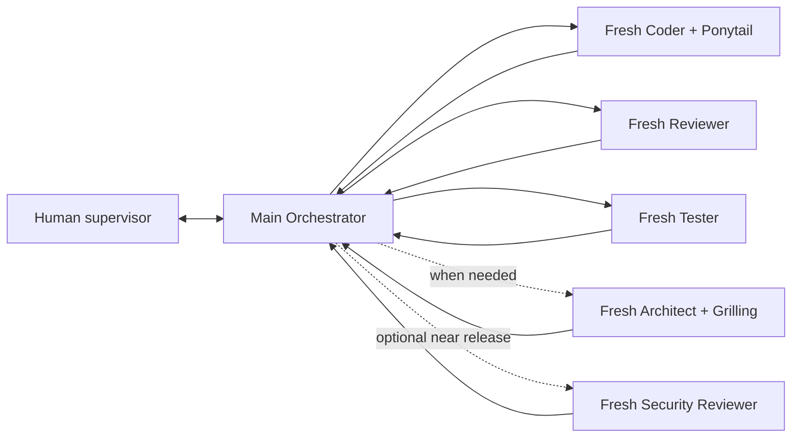

# Pavan's Workflow

A reusable **multi-model, multi-agent development workflow** for
[Oh My Pi (`omp`)](https://github.com/can1357/oh-my-pi), with
[Graphify](https://github.com/Graphify-Labs/graphify) for scoped code
intelligence and a project-local adaptation of
[Ponytail](https://github.com/DietrichGebert/ponytail) for minimal compliant
implementation.

> ⚡ **Workflow v3.0.0 is live.** Update an installed project from its root:
>
> ```bash
> ( tmp_dir="$(mktemp -d)" && git clone -q --depth 1 https://github.com/Pavan-Gopa/Pavans-Workflow.git "$tmp_dir/pw" && bash "$tmp_dir/pw/AI_Workflow_Kit/script/workflow_update.sh" apply; rc=$?; rm -rf "${tmp_dir:-}"; exit "$rc" )
> ```
>
> Inside OMP, use `/work-update` or `/workflow-update`. Restart OMP after the
> update so the new extensions, agents, and skills are discovered.

## v3 highlights

- **Ponytail for Coder only:** primary and backup Coder agents automatically
  apply a pinned, workflow-safe minimal implementation policy. Other roles keep
  independent correctness, QA, architecture, and security contracts.
- **Smarter Graphify:** Graphify is used for non-trivial discovery and blast
  radius, while an exact known local symbol can use focused LSP/grep/read.
  Real-source verification is always mandatory.
- **Graphify profiles:** `fast`, `deep`, `semantic`, and `force`, with JSON
  validation and last-good recovery. Normal work uses local AST code-only mode.
- **Manual OMP Stats:** no startup server, no persistent widget, no startup
  warning, and no automatic lifecycle sync. Alt+W always shows the copyable URL;
  `o` or `/workflow-stats` starts it explicitly.
- **Reproducible dependencies:** tested Ponytail and Graphify versions are
  recorded under `AI_Workflow_Kit/vendor/`.
- **All v2 foundations remain:** progressive onboarding, stable checklist IDs,
  dual Todo views, passive workflow metrics, live dashboard, fresh workers, and
  Human-authorized model failover.

## Architecture



All routing goes through Main. Workers never route, invoke another worker,
commit, push, or write canonical workflow state.

Default step loop:

```text
Main -> Coder -> Main source/diff/gate verification
     -> Reviewer -> Main verification
     -> Tester -> Main verification
     -> next step
```

A failed gate produces compact verified retry memory: approach, observed
result, evidence, and rejection reason. Every retry is a new worker. Three
materially identical no-progress failures stop automatic retries; a new
approach, new evidence, or different failure is progress.

## Core properties

### Multi-model role pairs

Every role resolves through `.omp/config.yml`:

| Role | Primary | Human-authorized backup |
|---|---|---|
| Orchestrator | `@workflow_orchestrator` | `@workflow_orchestrator_backup` |
| Coder | `@workflow_coder` | `@workflow_coder_backup` |
| Reviewer | `@workflow_reviewer` | `@workflow_reviewer_backup` |
| Tester | `@workflow_tester` | `@workflow_tester_backup` |
| Architect | `@workflow_architect` | `@workflow_architect_backup` |
| Security | `@workflow_security` | `@workflow_security_backup` |

Persistent model/provider failure pauses the workflow. Main never switches to a
backup automatically. The Human must explicitly authorize the recorded role;
the backup still passes the normal repository and gate verification.

### Fresh context and file-backed memory

Each worker receives only its role contract, current assignment, stable IDs,
target files, gates, source-of-truth paths, and compact verified retry facts.
Worker transcripts and Main conversation history are not handoff memory.

Durable state lives in:

- `AI_Workflow_Kit/docs/AI/STATE.yaml`;
- `AI_Workflow_Kit/docs/STEPS.md`;
- `AI_Workflow_Kit/docs/DECISIONS.md`;
- feedback and gate reports;
- actual repository, diff, and test evidence.

Main alone checks or reopens stable checklist IDs (`<step>.D<n>`, `.O<n>`,
`.J<n>`) after verification. OMP's native Todo is a separate runtime list.

### Ponytail without role leakage

The project-local `ponytail/SKILL.md` is autoloaded only by Coder and backup
Coder. Its precedence is deliberately strict:

1. role/output contract;
2. confirmed requirement, target files, stable IDs, and gates;
3. security, validation, accessibility, compatibility, and data integrity;
4. real source evidence;
5. minimal implementation policy.

Main assigns `ponytail_mode: off|lite|full`; default is `full`, and it does not
persist across fresh workers. Reviewer performs correctness first, then a bounded
material-complexity check. Tester and Security never reduce gates for brevity.

Manual one-shot skills are available:

```text
/skill:ponytail-review
/skill:ponytail-audit
/skill:ponytail-debt
```

### Conditional Graphify navigation

Use Graphify when discovery is genuinely non-trivial: unknown entry points,
cross-file behavior, callers/callees, dependency paths, public contracts,
schemas, trust boundaries, and blast radius. When Main already names an exact
local file and symbol, focused source tools may be smaller.

In both paths:

```text
LOCATE -> READ REAL SOURCE -> VERIFY -> EDIT OR CONCLUDE
```

Graph profiles:

```bash
bash AI_Workflow_Kit/script/graphify_rebuild.sh fast      # normal, local, incremental
bash AI_Workflow_Kit/script/graphify_rebuild.sh deep      # clustered code map
bash AI_Workflow_Kit/script/graphify_rebuild.sh semantic  # explicit docs/media pass
bash AI_Workflow_Kit/script/graphify_rebuild.sh force     # full local recovery
```

Graphify is advisory. A stale or unavailable graph never replaces source and
never blocks a source-based workflow by itself.

### Alt+W live dashboard

Press **Alt+W** or run `/workflow-dashboard` to see:

- plan order and completed/remaining steps;
- Main-verified `STEP CHECKLIST` and native `RUN TODO` linkage;
- current role, model, activity, stable work item, gates, and blockers;
- passive per-step/team metrics;
- current-session model token consumption;
- the copyable OMP Stats URL.

Useful keys: `Up`/`Down`, `c` current step, `t` Todo view, `PgUp`/`PgDn`, `r`
refresh, `?` help, and `Alt+W`/`Esc`/`q` close.

### OMP Stats is manual

The footer always shows:

```text
OMP Stats · manual · http://127.0.0.1:3847
```

Nothing is launched or probed when OMP starts, and no widget is placed below the
editor. Press `o` in Alt+W or run `/workflow-stats` to explicitly start, sync,
and open the local dashboard. Stats failures never affect workflow execution.

Passive workflow metrics (`/workflow metrics`) are separate and remain stored
inside Git's private common directory, outside commits.

## Requirements

- OMP;
- Git;
- Python 3.10+;
- Graphify CLI (`graphifyy`, tested with `0.9.46`);
- model provider credentials selected by the user.

No API key is hard-coded.

## Install

### New repository

```bash
git clone https://github.com/Pavan-Gopa/Pavans-Workflow.git my-project
cd my-project
bash install.sh .
```

### Existing repository

```bash
tmp_dir="$(mktemp -d)"
git clone --depth 1 https://github.com/Pavan-Gopa/Pavans-Workflow.git "$tmp_dir/pw"
bash "$tmp_dir/pw/install.sh" /absolute/path/to/your/project
rm -rf "$tmp_dir"
```

The installer refuses to overwrite existing workflow paths. Use the updater for
an existing installation.

Full installation notes: [INSTALL.md](INSTALL.md).

## Start

```bash
bash AI_Workflow_Kit/script/omp_workflow.sh
```

The launcher pins OMP to the exact project root, which is required for project
roles, extensions, and skills. Configure role models through **Alt+M -> Roles**.
Use `/workflow onboard`, `/workflow setup`, or `/workflow status` as needed.

Useful controls:

| Action | Control |
|---|---|
| Update framework | `/work-update` or `/workflow-update` |
| Dry-run update | `/work-update check` |
| Reconcile and continue | `/workflow status` |
| Explain routing | `/workflow why` |
| Live workflow dashboard | `Alt+W` |
| Agent Hub | `Alt+A` |
| Model role selector | `Alt+M` |
| Manual OMP Stats | `o` in Alt+W or `/workflow-stats` |
| Passive workflow report | `/workflow metrics` |
| Human rating | `/workflow metrics rate good|overkill|underchecked` |
| Authorize recorded backup | `continue <role> with backup` |
| Schema migration | `bash AI_Workflow_Kit/script/workflow_migrate.sh apply` |
| Installation diagnostics | `bash AI_Workflow_Kit/script/workflow_doctor.sh` |

## Update from a terminal

Run from the root of any installed workflow project:

```bash
( tmp_dir="$(mktemp -d)" && git clone -q --depth 1 https://github.com/Pavan-Gopa/Pavans-Workflow.git "$tmp_dir/pw" && bash "$tmp_dir/pw/AI_Workflow_Kit/script/workflow_update.sh" apply; rc=$?; rm -rf "${tmp_dir:-}"; exit "$rc" )
```

Preview without changing files:

```bash
bash AI_Workflow_Kit/script/workflow_update.sh check
```

The updater preserves `.omp/config.yml` and live state, plans, decisions,
feedback, and reports. It stores a framework backup under Git's private common
directory, applies migration, refreshes Graphify in fast mode, and runs the
workflow doctor. Restart OMP afterward.

## Repository map

```text
.omp/                         agents, commands, extensions, shared contract
ponytail*/                    project-local implementation/review/audit skills
grilling/                     architecture discovery skill
AI_Workflow_Kit/docs/         durable workflow state and role contracts
AI_Workflow_Kit/script/       launcher, update, doctor, metrics, Graphify
AI_Workflow_Kit/vendor/       tested dependency lock and third-party license
VERSION                       current workflow version
CHANGELOG.md                  release notes
```

MIT. See [LICENSE](LICENSE).
