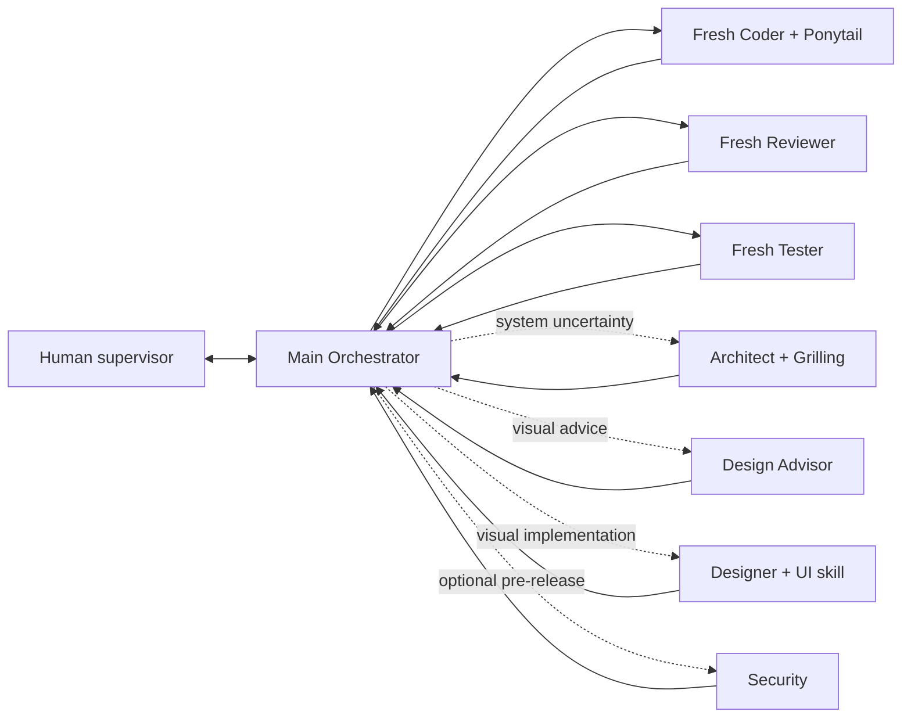

# Pavan's Workflow

A reusable **multi-model, multi-agent development workflow** for
[Oh My Pi (`omp`)](https://github.com/can1357/oh-my-pi), with scoped
[Graphify](https://github.com/Graphify-Labs/graphify) navigation, Coder-only
[Ponytail](https://github.com/DietrichGebert/ponytail), durable file-backed state,
and optional Human-requested Product Designer roles.

> **Workflow v3.2.0 is live.**
>
> Update an installed workflow project from its root:
>
> ```bash
> (
>   set -Eeuo pipefail
>   tmp_dir="$(mktemp -d)"
>   trap 'rm -rf "$tmp_dir"' EXIT
>   git clone -q --depth 1 https://github.com/Pavan-Gopa/Pavans-Workflow.git "$tmp_dir/pw"
>   bash "$tmp_dir/pw/AI_Workflow_Kit/script/workflow_update.sh" apply "$PWD"
> )
> ```
>
> Then restart OMP. Inside OMP you can also run `/work-update` or
> `/workflow-update`, then restart the session.

## v3.2 highlights

- **Main-only Context Economy.** Automatic context maintenance is scoped to the
  top-level interactive Main session. Workers are excluded from Main compaction.
  Main warns near 23%, waits for active work to reach a safe boundary, and can
  perform `shake -> soft` maintenance around the 28% upper target.
- **Quick Worker Focus.** With an empty composer, press `Tab` in Main to jump
  directly into the currently running workflow worker. While viewing that worker,
  press `Tab` or `Esc` to return to Main. If the composer contains text,
  autocomplete is open, an overlay owns focus, or no worker is running, Tab keeps
  normal OMP completion behavior.
- **DEFAULT is the Main model source of truth.** `workflow_orchestrator` aliases
  `@default`, and the live Main model is reconciled with the persisted role
  selection. This synchronization is explicitly disabled in task/headless worker
  sessions.
- **Stable update path.** Context Economy is no longer a separate experiment to
  install manually. Fresh installs and normal workflow updates install/repair the
  v3.2 runtime automatically while preserving project state and model choices.
- **Long-running workers.** Workflow task agents have a minimum four-hour hard
  wall (`maxRuntimeMs: 14400000`), while OMP's request-count forced-yield guard is
  disabled for workflow roles (`softRequestBudget: 0`). Human abort remains
  available through Agent Hub.
- **Fullscreen Alt+W dashboard.** The full plan, step checklist, native RUN TODO,
  active worker, gates, failures, model usage, and Stats URL live in one scrollable
  fullscreen inspector with mouse-wheel and keyboard navigation.
- **Native manual OMP Stats.** Stats starts only after an explicit `o` or
  `/workflow-stats` action and delegates to OMP's own Stats implementation instead
  of copying its private dashboard security protocol.
- **Optional Product Design path.** Design Advisor can return a read-only visual
  brief; Designer can make bounded presentation-layer edits when explicitly
  requested by the Human. Normal review, QA, and final Human acceptance still
  apply.

Full release history: [CHANGELOG.md](CHANGELOG.md).

## Architecture



All routing goes through Main. Workers never route, invoke another worker,
commit, push, or write canonical workflow state.

The normal engineering loop is:

```text
Main -> Coder -> Main verification
     -> Reviewer -> Main verification
     -> Tester -> Main verification
     -> next step
```

Designer is not automatic. It is entered only after explicit Human intent.

## Quick Worker Focus

The fast path for inspecting the worker currently doing the job:

```text
Main + empty composer + running worker
                Tab
                 ↓
        live worker session

live worker + empty composer
          Tab or Esc
              ↓
             Main
```

Quick Focus is contextual, not a global Tab rebind. Normal autocomplete keeps
Tab whenever Quick Focus conditions are not satisfied. Agent Hub (`Alt+A`)
remains the full roster, history, intervention, abort, and recovery surface.

## Main model and role pairs

Configure roles through **Alt+M → Roles**.

`DEFAULT` is the authoritative Main model slot in v3.2. The Orchestrator role is
kept synchronized with it rather than maintaining a second independent Main
selection.

| Role | Primary | Human-authorized backup |
|---|---|---|
| Orchestrator | `@workflow_orchestrator` (`@default`) | `@workflow_orchestrator_backup` |
| Coder | `@workflow_coder` | `@workflow_coder_backup` |
| Reviewer | `@workflow_reviewer` | `@workflow_reviewer_backup` |
| Tester | `@workflow_tester` | `@workflow_tester_backup` |
| Architect | `@workflow_architect` | `@workflow_architect_backup` |
| Security | `@workflow_security` | `@workflow_security_backup` |
| Design Advisor | `@workflow_design_advisor` | `@workflow_design_advisor_backup` |
| Designer | `@workflow_designer` | `@workflow_designer_backup` |

Persistent model/provider failure pauses the workflow. Main does not silently
switch to a backup; the Human authorizes fallback.

## Context Economy

v3.2 promotes the experimental Context Economy line into the stable workflow.
The policy is deliberately **Main-only**:

```text
worker/task session
    -> no Main context-maintenance loop

interactive Main
    -> warn near 23%
    -> wait while worker is active
    -> maintain context at a safe idle boundary
    -> shake -> soft around the 28% upper target
```

This keeps Main responsive on long projects without letting inherited project
extensions retarget or compact Coder/Reviewer/Tester sessions as though they
were the Orchestrator.

## Optional Designer path

### Read-only design advice

```text
/workflow designer advise settings panel
```

or simply ask Main to consult Designer without allowing direct edits. The Design
Advisor returns a concrete implementation brief tied to files/components,
responsive and accessibility constraints, non-goals, implementation order, and
observable acceptance criteria.

### Direct presentation-layer redesign

```text
/workflow designer redesign settings panel
```

Main confirms the target surface and preserved behavior, then dispatches the
Designer. The role may edit only the approved presentation-layer scope and
associated UI tests/assets. The result still passes Main verification, Reviewer,
enabled Tester, and final Human visual acceptance.

## Ponytail without role leakage

Only primary and backup Coder autoload `ponytail`. Confirmed scope, stable IDs,
gates, validation, security, accessibility, compatibility, and data integrity
outrank simplification. Designer and Advisor use the UI design skill rather than
Coder's simplification policy.

Manual one-shot skills remain available:

```text
/skill:ponytail-review
/skill:ponytail-audit
/skill:ponytail-debt
```

## Conditional Graphify

```text
non-trivial discovery -> Graphify -> focused real source -> verify
known exact local symbol -> focused LSP/grep/read -> verify
```

Profiles:

```bash
bash AI_Workflow_Kit/script/graphify_rebuild.sh fast
bash AI_Workflow_Kit/script/graphify_rebuild.sh deep
bash AI_Workflow_Kit/script/graphify_rebuild.sh semantic
bash AI_Workflow_Kit/script/graphify_rebuild.sh force
```

Graphify is advisory. Workflow updates preserve the existing graph and defer
refresh by default so a framework update cannot appear frozen on a large repo.
Use `--refresh-graphify` when you explicitly want a bounded refresh during the
update.

## Alt+W live dashboard

`Alt+W` opens a **fullscreen read-only inspector** showing the complete workflow
board: plan, selected/live step, Main-verified `STEP CHECKLIST`, native `RUN TODO`,
active worker/model/tool, gates, blockers, passive metrics, session tokens, and
the copyable Stats URL.

Markers:

```text
* = selected for inspection
> = live workflow step
✓ = completed
● = current/running
○ = planned
```

The dashboard has one vertical viewport over the complete logical board. Long
plans and Todo lists are scrolled rather than replaced with `N more detail lines`.

```text
mouse wheel        scroll
PageUp/PageDown    one page
Shift+Up/Down      fast vertical scroll
g / G              top / bottom
Up/Down            inspect previous/next workflow step
Home/End            first/last workflow step
c                   return to live step / resume follow
```

Manual scrolling pauses live-follow so runtime updates do not yank the viewport
away while older content is being inspected.

## OMP Stats is manual

The dashboard exposes the local Stats URL, normally:

```text
http://127.0.0.1:3847
```

Nothing starts at OMP launch. Press `o` in Alt+W or run `/workflow-stats` to
explicitly sync, start/reuse native OMP Stats, and open it in the browser.

## Long-running worker policy

Workflow agents may legitimately spend hours on large repositories, migrations,
long test suites, and tool-heavy implementation work:

```yaml
task:
  maxRuntimeMs: 14400000
  softRequestBudget: 0
```

Four hours is the workflow's minimum hard wall; the updater does not reduce a
larger project-specific runtime that was already configured. Human abort remains
available through Agent Hub and workflow retry/stall rules still apply.

## Install

### New repository

```bash
git clone https://github.com/Pavan-Gopa/Pavans-Workflow.git my-project
cd my-project
bash install.sh .
```

### Existing repository without the workflow

```bash
tmp_dir="$(mktemp -d)"
git clone --depth 1 https://github.com/Pavan-Gopa/Pavans-Workflow.git "$tmp_dir/pw"
bash "$tmp_dir/pw/install.sh" /absolute/path/to/your/project
rm -rf "$tmp_dir"
```

Use the updater, not the installer, for projects already running an earlier
Pavan's Workflow release. Full notes: [INSTALL.md](INSTALL.md).

## Start

```bash
bash AI_Workflow_Kit/script/omp_workflow.sh
```

## Update an existing workflow project

Close that project's OMP process first, then run from the project root:

```bash
(
  set -Eeuo pipefail
  tmp_dir="$(mktemp -d)"
  trap 'rm -rf "$tmp_dir"' EXIT
  git clone -q --depth 1 https://github.com/Pavan-Gopa/Pavans-Workflow.git "$tmp_dir/pw"
  bash "$tmp_dir/pw/AI_Workflow_Kit/script/workflow_update.sh" apply "$PWD"
)
```

The v3.2 updater automatically installs/repairs the stable Context Economy
payload, preserves durable workflow state, keeps project model selections,
maintains the four-hour-or-longer runtime policy, restores the canonical Main
control plane, and runs the workflow doctor before declaring the project ready.

Legacy v3.1.0 projects whose invalid YAML caused OMP to rename `.omp/config.yml`
to `.omp/config.yml.broken-*` are still recovered automatically from the newest
usable project-specific config/backup.

The updater preserves:

- project model selections and unrelated `.omp/config.yml` settings;
- `STATE.yaml`, `STEPS.md`, `PROJECT_CONTEXT.md`, decisions, feedback, and reports;
- product code and tests;
- custom `.graphifyignore` rules and existing Graphify output by default.

To refresh Graphify during the same update, append `--refresh-graphify`.

## Useful controls

| Action | Control |
|---|---|
| Quick focus active worker | `Tab` on empty Main composer |
| Return from focused worker | `Tab` on empty worker composer or `Esc` |
| Agent Hub / full roster | `Alt+A` |
| Live workflow dashboard | `Alt+W` |
| Dashboard scroll | mouse wheel / PgUp/PgDn / Shift+Up/Down / `g`/`G` |
| Model roles | `Alt+M` |
| Update framework | `/work-update` or `/workflow-update` |
| Dry-run update | `/work-update check` |
| Reconcile and continue | `/workflow status` |
| Explain routing | `/workflow why` |
| Designer advice | `/workflow designer advise <surface>` |
| Designer edits | `/workflow designer redesign <surface>` |
| Manual OMP Stats | `o` in Alt+W or `/workflow-stats` |
| Diagnostics | `bash AI_Workflow_Kit/script/workflow_doctor.sh` |

## Repository map

```text
.omp/                         agents, commands, extensions, shared runtime
ui-designer/                  progressive UI/UX skill for optional design roles
ponytail*/                    Coder simplification and one-shot audit skills
grilling/                     architecture discovery skill
AI_Workflow_Kit/docs/         durable workflow state and role contracts
AI_Workflow_Kit/script/       launcher, update, doctor, metrics, Graphify
AI_Workflow_Kit/vendor/       dependency/version metadata
VERSION                       current workflow version
CHANGELOG.md                  release notes
```

MIT. See [LICENSE](LICENSE).
