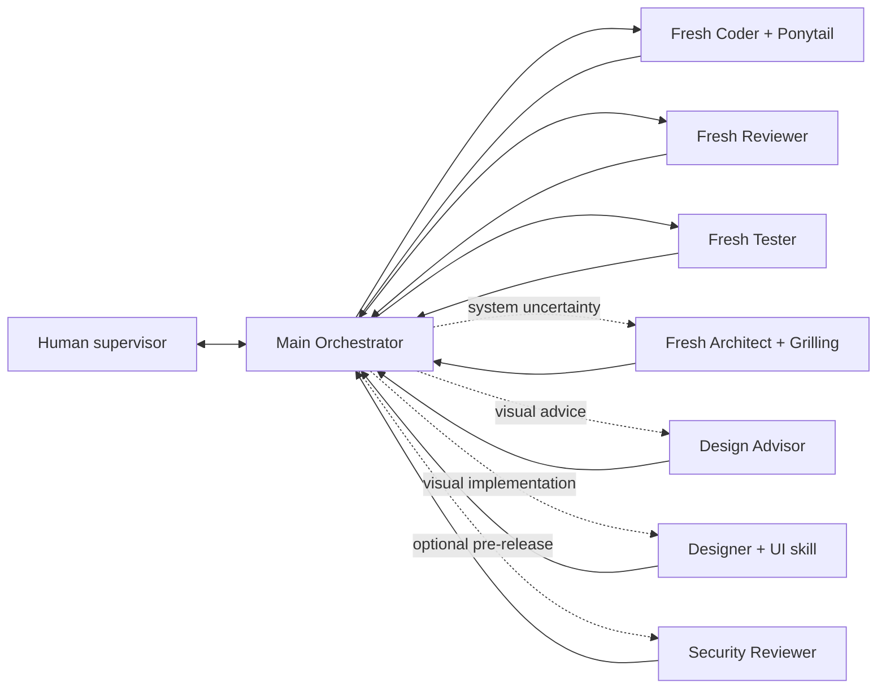

# Pavan's Workflow

[](CHANGELOG.md)
[](https://github.com/can1357/oh-my-pi)
[](https://github.com/Pavan-Gopa/Pavans-Workflow/actions/workflows/ci.yml)
[](LICENSE)

A reusable multi-model, multi-agent engineering workflow for
[Oh My Pi (`omp`)](https://github.com/can1357/oh-my-pi), with scoped
[Graphify](https://github.com/Graphify-Labs/graphify) navigation, durable
file-backed state, independent primary/backup role models, Coder-only Ponytail,
and optional product-design roles.

> **v3.4.2 fixes Main model switching.** `DEFAULT` is now the only editable
> Main-model slot. The internal `workflow_orchestrator` alias is hidden from the
> role picker, and the old 200 ms live-model reconciliation loop has been
> removed. OMP can now finish its native model + effort selection flow without a
> workflow extension changing the live model underneath the selector.

## Release highlights

### v3.4.2 — Main model picker stability

- Removes the polling race that could close OMP while the effort picker was open.
- Stops the workflow extension from calling `setModel()` or
  `setThinkingLevel()` during model-role changes.
- Keeps `workflow_orchestrator` as a managed alias to `@default` and hides that
  implementation role from **Alt+M → Roles**.
- Migrates older direct Orchestrator selections safely: when no explicit
  `DEFAULT` exists, the old selection is preserved as `DEFAULT` before the alias
  is repaired.
- Adds deterministic regression coverage and GitHub Actions CI.
- Refreshes README, installation guidance, version metadata, and release notes.

### v3.4.1 — Safer quick profiles

- Prevents `quick` closure for authentication, trust-boundary, API/schema,
  migration, and other public-contract changes.
- Groups metrics by pipeline profile, including retries and token counts.
- Preserves installer exit codes in copy-paste installation snippets.

### v3.4.0 — Lean pipeline in core

- Promotes `quick`, `standard`, and `critical` step-card profiles to the stable
  workflow.
- Adds deterministic Objective Gates, blast-radius Security offers,
  assignment-first worker packets, and retry-economy rules.

See [CHANGELOG.md](CHANGELOG.md) for the complete release history.

## How the workflow runs


```mermaid
flowchart LR
    H[Human supervisor] <--> M[Main Orchestrator]
    M --> C[Fresh Coder + Ponytail]
    C --> M
    M --> R[Fresh Reviewer]
    R --> M
    M --> T[Fresh Tester]
    T --> M
    M -. system uncertainty .-> A[Fresh Architect + Grilling]
    A --> M
    M -. visual advice .-> DA[Design Advisor]
    DA --> M
    M -. visual implementation .-> D[Designer + UI skill]
    D --> M
    M -. optional pre-release .-> S[Security Reviewer]
    S --> M
```

All routing goes through Main. Workers never route another worker, write
canonical workflow state, commit, or push.

Default engineering loop:

```text
Main -> Coder -> Main verification
     -> Reviewer -> Main verification
     -> Tester -> Main verification
     -> next step
```

The lean pipeline may skip a gate only when a step profile and deterministic
Objective Gates explicitly permit it. High-risk work cannot use the `quick`
shortcut.

## Main model control

The Main session has **one authoritative primary slot: `DEFAULT`**.

| Goal | Action |
|---|---|
| Change the persistent primary Main model | **Alt+M → Roles → DEFAULT**, then choose both model and effort |
| Temporarily move to the configured backup | Use the quick-switch control (`Alt+Q` in the workflow setup) |
| Make another model the new primary | Assign that model and effort to `DEFAULT` |
| Inspect the backup mapping | Open `workflow_orchestrator_backup` in **Alt+M → Roles** |

`workflow_orchestrator` remains in `cycleOrder` so launch and quick-switch
behavior continue to work, but it is hidden from the role editor because it is
only an alias to `@default`. Editing two independent Main entries was the source
of the former conflict.

After updating to v3.4.2, restart OMP so the new extension and model-tag metadata
are loaded.

## Role model pairs

Configure worker roles through **Alt+M → Roles**. Persistent provider/model
failure pauses the workflow; the Human explicitly authorizes a backup.

| Role | Primary | Human-authorized backup |
|---|---|---|
| Main Orchestrator | `DEFAULT` via `@workflow_orchestrator` | `@workflow_orchestrator_backup` |
| Coder | `@workflow_coder` | `@workflow_coder_backup` |
| Reviewer | `@workflow_reviewer` | `@workflow_reviewer_backup` |
| Tester | `@workflow_tester` | `@workflow_tester_backup` |
| Architect | `@workflow_architect` | `@workflow_architect_backup` |
| Security | `@workflow_security` | `@workflow_security_backup` |
| Design Advisor | `@workflow_design_advisor` | `@workflow_design_advisor_backup` |
| Designer | `@workflow_designer` | `@workflow_designer_backup` |

Worker changes apply on the next fresh spawn. Main-model changes through
`DEFAULT` are handled by OMP's native model selector.

## Core properties

### Fresh context

Each specialist is a fresh OMP task-agent session receiving only its stable role
contract, current assignment, source-of-truth paths, allowed scope, acceptance
criteria, and repository access.

### Files are memory

Durable state lives in files, including:

- `AI_Workflow_Kit/docs/AI/STATE.yaml`
- `AI_Workflow_Kit/docs/STEPS.md`
- `AI_Workflow_Kit/docs/DECISIONS.md`
- `AI_Workflow_Kit/docs/AI/FEEDBACK.md`
- QA, bug, security, and metrics reports

Worker completion never advances a gate by itself. Main verifies real source and
evidence first.

### Main-only Context Economy

The top-level interactive Main session warns near 23% context use and uses OMP's
native 28% hard threshold with mid-turn checkpoints. Task/headless workers do
not inherit Main's automatic compaction policy.

### Graphify-first, source-verified navigation

```text
non-trivial discovery -> Graphify -> focused real source -> verify
known exact symbol     -> focused LSP/grep/read           -> verify
```

Graphify is advisory. Actual source and test output remain authoritative.

### Live dashboard and quick focus

- `Alt+W` opens the fullscreen workflow dashboard.
- `Tab` on an empty Main composer focuses the currently running worker.
- `Tab` or `Esc` returns from that worker to Main.
- `Alt+A` remains the full Agent Hub for history, intervention, and abort.

## Install

### New repository

```bash
git clone https://github.com/Pavan-Gopa/Pavans-Workflow.git my-project
cd my-project
bash install.sh .
```

### Existing repository without the workflow

```bash
(
  set -Eeuo pipefail
  tmp_dir="$(mktemp -d)"
  trap 'rm -rf "$tmp_dir"' EXIT
  git clone --depth 1 https://github.com/Pavan-Gopa/Pavans-Workflow.git "$tmp_dir/pw"
  bash "$tmp_dir/pw/install.sh" /absolute/path/to/your/project
)
```

The installer refuses to overwrite existing workflow paths.

## Update an existing workflow project

Close OMP for that project, then run from the project root:

```bash
bash <(curl -fsSL https://raw.githubusercontent.com/Pavan-Gopa/Pavans-Workflow/main/install.sh) --update
```

Equivalent explicit-git form:

```bash
(
  set -Eeuo pipefail
  tmp_dir="$(mktemp -d)"
  trap 'rm -rf "$tmp_dir"' EXIT
  git clone -q --depth 1 https://github.com/Pavan-Gopa/Pavans-Workflow.git "$tmp_dir/pw"
  bash "$tmp_dir/pw/AI_Workflow_Kit/script/workflow_update.sh" apply "$PWD"
)
```

The updater preserves project model choices, durable workflow state, product
code, tests, reports, custom `.graphifyignore` rules, and the existing Graphify
index. Append `--refresh-graphify` for an explicit bounded graph refresh.

Legacy direct `workflow_orchestrator` values are migrated without destroying an
otherwise missing Main selection. The canonical alias and hidden-role metadata
are then validated before the update is declared ready.

Full platform notes: [INSTALL.md](INSTALL.md).

## Start

```bash
bash AI_Workflow_Kit/script/omp_workflow.sh
```

## Useful controls

| Action | Control |
|---|---|
| Change persistent Main primary | `Alt+M` → Roles → `DEFAULT` |
| Quick-switch Main/backup | `Alt+Q` |
| Configure worker role pairs | `Alt+M` → Roles |
| Quick-focus active worker | `Tab` on empty Main composer |
| Return from focused worker | `Tab` on empty worker composer or `Esc` |
| Full Agent Hub | `Alt+A` |
| Live workflow dashboard | `Alt+W` |
| Update framework | `/work-update` or `/workflow-update` |
| Dry-run update | `/work-update check` |
| Reconcile and continue | `/workflow status` |
| Explain routing | `/workflow why` |
| Designer advice | `/workflow designer advise <surface>` |
| Designer edits | `/workflow designer redesign <surface>` |
| Manual OMP Stats | `o` in Alt+W or `/workflow-stats` |
| Diagnostics | `bash AI_Workflow_Kit/script/workflow_doctor.sh` |

## Verify

Dependency-free deterministic checks run in GitHub Actions. For an installed
project, run the full local doctor as well so OMP, Graphify, provider setup, and
the local graph are checked:

```bash
cat VERSION
python3 AI_Workflow_Kit/script/workflow_config_repair.py check .omp/config.yml
bash AI_Workflow_Kit/script/workflow_doctor.sh
```

Expected version:

```text
3.4.2
```

## Repository map

```text
.omp/                         agents, commands, extensions, shared runtime
.github/workflows/ci.yml      deterministic repository checks
ui-designer/                  progressive UI/UX skill for optional design roles
ponytail*/                    Coder simplification and one-shot audit skills
grilling/                     architecture discovery skill
AI_Workflow_Kit/docs/         durable workflow state and role contracts
AI_Workflow_Kit/script/       launcher, updater, doctor, metrics, Graphify tools
AI_Workflow_Kit/vendor/       dependency/version metadata
VERSION                       current workflow version
CHANGELOG.md                  complete release history
```

MIT. See [LICENSE](LICENSE).
