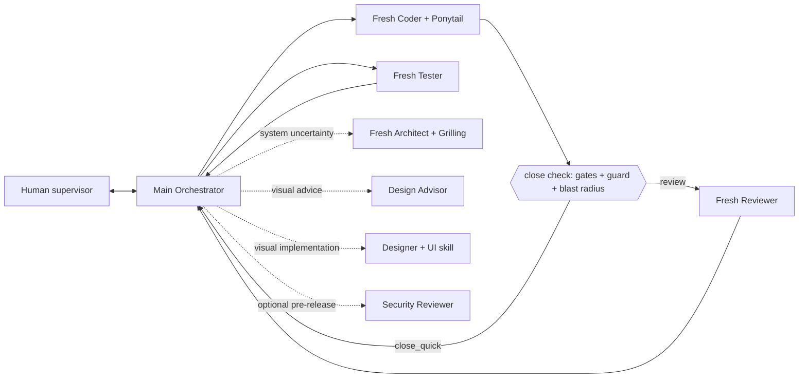

# Pavan's Workflow

[](CHANGELOG.md)
[](https://github.com/can1357/oh-my-pi)
[](https://github.com/Pavan-Gopa/Pavans-Workflow/actions/workflows/ci.yml)
[](LICENSE)

A reusable multi-model, multi-agent engineering workflow for
[Oh My Pi (`omp`)](https://github.com/can1357/oh-my-pi): fresh specialized
workers, durable file-backed state, independent primary/backup role models,
scoped [Graphify](https://github.com/Graphify-Labs/graphify) navigation,
Coder-only Ponytail, and optional product-design roles — with the important
boundaries checked in code, not only in prompts.

> **3.7: fast-coder, automatic failover, and red proof for fix rounds.**
> First attempts use deterministic routing for Fast Coder (`workflow-coder-fast`),
> gate timeouts are no longer blamed on the Coder, primary model/provider failures
> automatically fail over to configured backup agents without pausing for Human authorization,
> and fix rounds require reproducible red proof for fixed findings.
> Details: [CHANGELOG.md](CHANGELOG.md).

## How the workflow runs


```mermaid
flowchart LR
    H[Human supervisor] <--> M[Main Orchestrator]
    M --> C[Fresh Coder + Ponytail]
    C --> G{{close check: gates + guard + blast radius}}
    G -- close_quick --> M
    G -- review --> R[Fresh Reviewer]
    R --> M
    M --> T[Fresh Tester]
    T --> M
    M -. system uncertainty .-> A[Fresh Architect + Grilling]
    M -. visual advice .-> DA[Design Advisor]
    M -. visual implementation .-> D[Designer + UI skill]
    M -. optional pre-release .-> S[Security Reviewer]
```

All routing goes through Main. Workers never route another worker, write
workflow state, commit, or push — and the guard blocks those actions inside
the worker before they run.

## What is enforced, and by what

| Rule | Enforced by |
|---|---|
| Read-only roles change nothing; Coder/Designer stay in `target_files`; Tester in test paths; no worker edits workflow files or changes git state | `workflow-guard` extension: blocks the tool call inside the worker before it runs; `workflow_guard.py` verifies what the worker edited (changes by Main, the Human, or parallel sessions are never the worker's) |
| Backup workers start on recorded primary model/provider failure | `before_subagent_spawn` hook blocks unauthorized spawns |
| `quick` closes only with green command gates, manual gates checked, a clean Coder/Designer guard verdict and no open violation, no blast-radius hit, and risk not high | `workflow_close.py check` |
| Objective Gates are re-run by Main, not trusted from worker reports; the whole-project suite (`(close-only)`) runs once in the close check, not again in the Coder, and a failure arrives with its failing lines and full log | `workflow_gates.py` |
| The Tester runs on every step unless the close check decides `close_quick` or the card names an R14 skip reason (`human_opt_out`, `presentation_only`, `docs_only`, `mechanical_rename`) | `workflow_close.py check` (`tester.required`) · dashboard routing |
| Reviewer is independent of the Coder model (primary and backup) | doctor warning (`workflow_model_diversity.py`) |
| One worker at a time, no recursive spawning, no automatic model fallback | `.omp/config.yml` task/retry policy |

The full rule set (R1–R22) with each rule's enforcement is in
[`TEAM_CONTRACT.md`](AI_Workflow_Kit/docs/AI/TEAM_CONTRACT.md); rules marked
"Main" or "prompt" still rely on the model.

## Install

Requirements: `omp`, `git`, Python 3.9+. Graphify is installed on first run
when missing (optional; the workflow falls back to source tools).

### Into an existing repository (recommended)

```bash
cd /path/to/your/project
bash <(curl -fsSL https://raw.githubusercontent.com/Pavan-Gopa/Pavans-Workflow/main/install.sh) .
```

Your `README.md`, `CHANGELOG.md`, `VERSION`, and an existing `.omp/config.yml`
are kept (workflow roles are merged into the config). The installer refuses
to overwrite files it would otherwise replace and lists them. Commit the
installed files before the first step so the blast-radius check starts clean.

### New project

```bash
mkdir my-project && cd my-project && git init
bash <(curl -fsSL https://raw.githubusercontent.com/Pavan-Gopa/Pavans-Workflow/main/install.sh) .
```

Cloning this repository as your project also works (`bash install.sh .`), but
then point `origin` at your own repository so project work is never pushed
here.

## Update

Close OMP for the project, then from its root:

```bash
bash <(curl -fsSL https://raw.githubusercontent.com/Pavan-Gopa/Pavans-Workflow/main/install.sh) --update
```

Inside OMP: `/workflow-update check` (plan) or `/workflow-update`. From a
shell: `bash AI_Workflow_Kit/script/workflow_update.sh check|apply`. Add
`--ref v3.7.1` to pin a release, `--refresh-graphify` to rebuild the graph.

Updates install the newest `vX.Y.Z` release from
`AI_Workflow_Kit/framework.manifest`, remove framework files the release
deleted (unless you modified them), keep project state, model selections,
custom `.omp` files, `.graphifyignore` rules, and the Graphify index, and back
up every framework file they touch under
`<git-common-dir>/pavans-workflow/update-backups/`. If the framework step fails
it is rolled back automatically; the state migration keeps its own backups, and
a failing doctor is reported (not rolled back). Restart OMP afterwards.

Coming from 3.4.x: run the curl command above once. It removes the obsolete
`experiments/` payloads, restores root files an old updater overwrote (from its
backups), and tells you if a leftover root `VERSION`/`CHANGELOG.md` came from the
workflow. The old in-project `workflow_update.sh apply` also works: it hands over
to the 3.5 manager mid-run and completes the migration.

## Start

```bash
bash AI_Workflow_Kit/script/omp_workflow.sh
```

## Main model control

| Goal | Action |
|---|---|
| Change the persistent Main model | **Alt+M → Roles → DEFAULT**, choose model and effort |
| Temporarily use the backup | quick-switch (`Alt+Q`) |
| Inspect the backup mapping | `workflow_orchestrator_backup` in Alt+M → Roles |

`workflow_orchestrator` is a hidden managed alias to `@default`.

## Role model pairs

Configure through **Alt+M → Roles**. On a primary worker model/provider failure Main
fails over to the role's backup automatically (the Fast Coder has none and escalates to the Coder);
the Human is asked only when no distinct backup is configured or the backup fails.
Main's own backup is a manual live switch (`@workflow_orchestrator_backup`, Alt+Q).

| Role | Primary | Backup (automatic failover) |
|---|---|---|
| Main | `DEFAULT` via `@workflow_orchestrator` | `@workflow_orchestrator_backup` |
| Coder | `@workflow_coder` | `@workflow_coder_backup` |
| Reviewer | `@workflow_reviewer` | `@workflow_reviewer_backup` |
| Tester | `@workflow_tester` | `@workflow_tester_backup` |
| Architect | `@workflow_architect` | `@workflow_architect_backup` |
| Security | `@workflow_security` | `@workflow_security_backup` |
| Design Advisor | `@workflow_design_advisor` | `@workflow_design_advisor_backup` |
| Designer | `@workflow_designer` | `@workflow_designer_backup` |

Keep the Reviewer on a different model than both Coder entries, and spread
backups across providers; the doctor warns otherwise.

## Useful controls

| Action | Control |
|---|---|
| Live workflow dashboard | `Alt+W` |
| Model leaderboard across all projects (inside the dashboard) | `l` |
| Full Agent Hub | `Alt+A` |
| Quick-focus the running worker / return | `Tab` on an empty composer / `Tab` or `Esc` |
| Reconcile and continue | `/workflow status` |
| Explain routing | `/workflow why` |
| Close decision for the current step | `python3 AI_Workflow_Kit/script/workflow_close.py check` |
| Guard verdicts / record the Human's decision | `python3 AI_Workflow_Kit/script/workflow_guard.py status --all` / `resolve --id … --note …` |
| Guard mode for this repository | `python3 AI_Workflow_Kit/script/workflow_guard.py mode [enforce\|report\|off]` (or `WF_GUARD_MODE`) |
| Designer advice / edits | `/workflow designer advise <surface>` / `redesign <surface>` |
| Manual OMP Stats | `o` in Alt+W or `/workflow-stats` |
| Diagnostics | `bash AI_Workflow_Kit/script/workflow_doctor.sh` |

## Verify an installed project

```bash
cat AI_Workflow_Kit/VERSION
bash AI_Workflow_Kit/script/workflow_doctor.sh
```

Expected version:

```text
3.7.1
```

## Repository map

```text
.omp/                          agents, commands, extensions (dashboard, guard, quick focus, Main attribution), libs, selftests
AI_Workflow_Kit/framework.manifest   what the framework installs (single source for install/update/doctor/CI)
AI_Workflow_Kit/templates/     pristine project-state templates (rendered into projects when missing)
AI_Workflow_Kit/docs/AI/       rules (TEAM_CONTRACT.md), Main procedure, role contracts
AI_Workflow_Kit/script/        installer core, updater, doctor, gates, guard, close check, metrics, Graphify tools
AI_Workflow_Kit/vendor/        pinned dependency versions (Graphify, Ponytail, tested OMP)
ci/                            repository checks, end-to-end install/update test, tsc config (not installed)
ponytail*/ grilling/ ui-designer/   skills
```

## Developing the framework

```bash
python3 ci/repo_checks.py                 # template purity, versions, manifest coverage, rule IDs
bash ci/e2e_install_update.sh             # install, update, 3.4.2 migration with stub omp
for t in AI_Workflow_Kit/script/*.selftest.py; do python3 "$t"; done
for t in AI_Workflow_Kit/script/*.selftest.sh; do bash "$t"; done
for t in .omp/tests/*.selftest.ts; do node --experimental-strip-types "$t"; done
bun ci/omp_runtime_guard.ts               # guard inside a real OMP session (needs ci/typecheck deps)
```

Never commit rendered project state: edit `AI_Workflow_Kit/templates/`
instead. A release is `VERSION` + `AI_Workflow_Kit/VERSION` +
`dependencies.lock` + a CHANGELOG entry, then a `vX.Y.Z` tag; the release
workflow checks they agree.

MIT. See [LICENSE](LICENSE).
